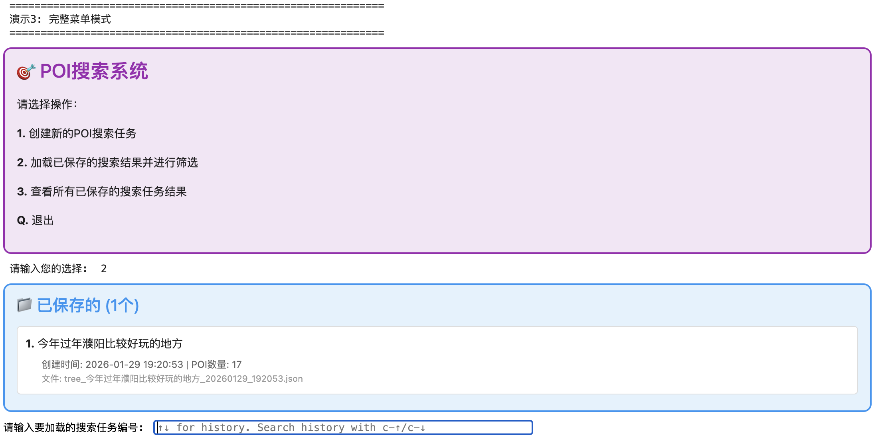
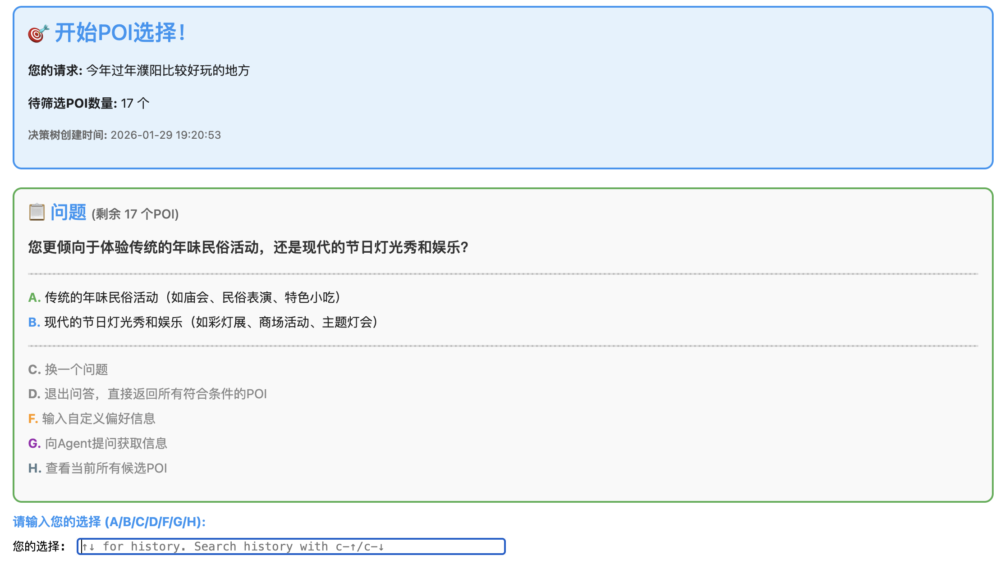
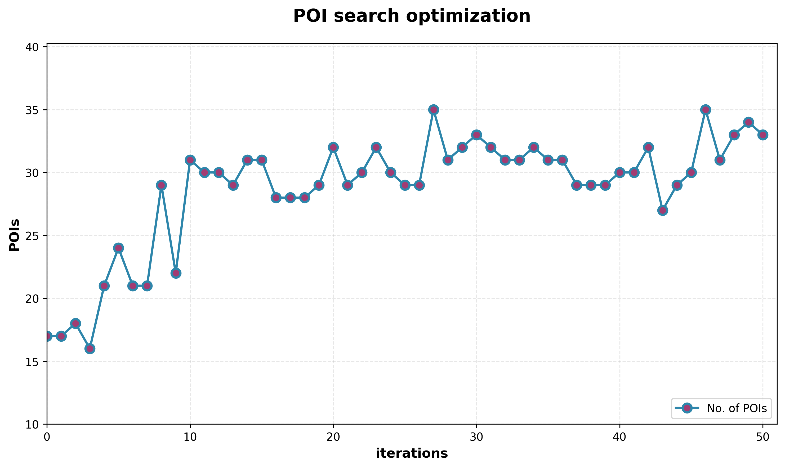
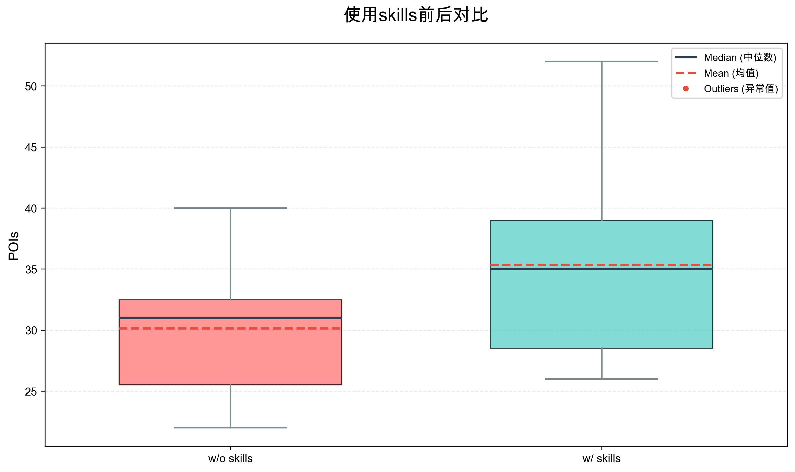

# POI-Scout

一个智能旅行目的地搜索Agent，通过搜索API和爬虫组合的工具搜索满足用户需求的POI（Point of Interest），并支持在线/离线优化和交互式筛选。

## 特性

- **智能需求分解**：基于用户模糊或简单的请求，自动分解成多个可能的主题，提供满足用户需求的不同类别目的地
- **在线优化 (On-policy)**：通过模型自我迭代，实时提高搜索数量和质量
- **离线经验总结 (Off-policy)**：根据在线优化的经验自动撰写skills，供下一次搜索使用
- **交互式筛选**：基于候选POI池，大模型自动生成问题帮助用户挑选目标POI，只需回答几个问题即可得到理想目的地
- **决策树持久化**：支持保存和加载决策树，方便重复使用

## 项目结构

```
POI-Scout/
├── main.py                     # 主程序入口
├── config.py                   # 配置文件（包含API密钥，不要提交到git）
├── config.example.py           # 配置文件模板
├── requirements.txt            # 依赖列表
├── src/                        # 源代码
│   ├── core/                   # 核心基础设施
│   │   ├── basellm.py          # 基座模型API封装
│   │   └── prompts.py          # 提示词模板
│   ├── tools/                  # 工具能力层
│   │   ├── tools.py            # Agent使用的工具集
│   │   ├── crawler.py          # 网页爬虫
│   │   └── extractor.py        # 网页内容提取器
│   ├── agent/                  # Agent框架
│   │   └── react.py            # ReAct Agent实现
│   ├── search/                 # 搜索业务模块
│   │   ├── process.py          # 搜索候选POI及在线/离线优化流程
│   │   ├── searchagent.py      # 在线优化模块
│   │   └── gen_advice.py       # 离线经验总结模块
│   └── selector/               # POI选择业务模块
│       └── selector.py         # POI决策问题生成和决策树模块
├── data/                       # 数据文件
│   ├── skills.json             # 离线优化生成的经验和技能
│   └── decision_trees/         # 决策树存储目录
└── docs/                       # 文档资源
    └── images/                 # 截图和图片
```

## 安装

### 1. 克隆项目

```bash
git clone <repository-url>
cd POI-Scout
```

### 2. 创建虚拟环境（推荐）

```bash
python -m venv venv
source venv/bin/activate  # Linux/macOS
# 或
venv\Scripts\activate     # Windows
```

### 3. 安装依赖

```bash
pip install -r requirements.txt
```

### 4. 安装 Playwright 浏览器

```bash
playwright install chromium
```

### 5. 配置API密钥

```bash
cp config.example.py config.py
```

编辑 `config.py`，填入你的API密钥：

```python
# SiliconFlow API
SILICONFLOW_API_KEY = "your-siliconflow-api-key"

# 博查搜索 API
BOCHA_API_KEY = "your-bocha-api-key"
```

## 使用方法

### 基础用法

```bash
python main.py
```

### 命令行参数

```bash
python main.py [OPTIONS]

选项:
  --online-opt        启用在线优化模式
  --use-skill         使用历史经验（从data/skills.json中读取）
  --create-skill      基于本次任务生成新经验
  --opt-iterations N  在线优化迭代次数（默认: 10）
```

### 示例

```bash
# 基础搜索（不启用优化）
python main.py

# 启用在线优化
python main.py --online-opt

# 使用历史经验并生成新经验
python main.py --use-skill --create-skill

# 完整优化模式
python main.py --online-opt --opt-iterations 15 --use-skill --create-skill
```

## 界面演示

### 主界面

用户可以选择创建新的搜索任务或加载已保存的搜索结果：



### 交互式筛选界面

基于决策树的问答筛选，帮助用户快速找到理想的POI：



## 工作流程

1. **输入需求**：用户输入旅行需求（如"我想找一个适合周末去玩的地方"）
2. **搜索规划**：Agent根据需求生成多个搜索主题
3. **信息搜索**：使用搜索API和爬虫获取候选POI
4. **在线优化**（可选）：通过自我迭代优化搜索结果
5. **经验总结**（可选）：总结本次搜索经验供后续使用
6. **交互式筛选**：通过问答帮助用户从候选POI中选择

## 核心创新点

### 1. 多步骤搜索规划

对于不清晰或模糊的搜索请求，可能存在多个符合条件的POI。Agent通过设计多步骤的搜索计划，探索多个可能方向的候选POI后进行聚合，从而最大化覆盖用户潜在需求。

### 2. 基于Reflection的在线优化（On-policy）

由于外部搜索工具的黑盒性，模型可能不知道如何提出搜索请求才能最大程度增加POI的召回数量。我们参考 [TextGrad](https://arxiv.org/abs/2406.07496) 框架，通过 **Reflection** 机制让模型定位搜索效率较低的步骤，并检视整个搜索过程（每个步骤的搜索请求由ReAct Agent执行）对该步骤进行改进。

为提高优化过程的稳定性，我们采用了正则化手段（如重新采样等方法），防止优化陷入局部最优点。

> **为什么称为 On-policy？** 在本项目中，我们将"策略"定义为 Agent 针对特定请求生成的搜索方案（plan）。On-policy 指的是：当前方案执行产生反馈（POI数量、搜索效率等）→ 用这些反馈改进**同一个方案**。策略与数据来源绑定，符合强化学习中 on-policy 的核心特征。


*图：某个搜索任务的优化步骤曲线（请求："金华适合带娃的地方"）*

### 3. 离线经验总结与复用（Off-policy）

为保留在线优化探索的经验，我们对比优化前后的方案和结果，通过语言形式形成一次 **GAE（Generalized Advantage Estimation）**，然后让模型自动总结经验作为 skill，供后续类似搜索请求使用。此方法参考 [GEPA](https://arxiv.org/abs/2507.19457) 的设计思路。

> **为什么称为 Off-policy？** 这里的经验来自**其他任务的搜索方案**执行结果，而非当前任务。用"别人的经验"来辅助当前任务的方案生成，策略与数据来源分离，体现了 off-policy 跨策略经验复用的思想。

**实验结果**（n=15）：使用skills后POI召回数量提升**17.3%**（均值30.1→35.3），差异具有统计显著性（p=0.035, Cohen's d=0.815）。


*图：使用skills前后POI数量对比*

### 4. 贝叶斯决策树交互选择

为帮助用户进一步确定目的地，我们参考 [贝叶斯实验方法](https://arxiv.org/abs/2508.21184) 设计了用户交互决策树。通过多轮A/B选择，系统能够快速收敛到用户真正感兴趣的POI，大幅减少用户筛选成本。

## API 依赖

本项目需要以下API服务：

| 服务 | 用途 | 获取方式 |
|------|------|----------|
| SiliconFlow | 大语言模型和Embedding | https://siliconflow.cn |
| 博查搜索 | 网页搜索 | https://bochaai.com |

## 技术架构

### Agent框架
- **ReAct Agent**：基于Thought-Action-Observation循环的Agent框架，支持动态工具调用
- **Search Agent**：执行搜索计划，通过搜索API和爬虫获取POI信息
- **Answer Agent**：处理用户交互选择，辅助决策树问答

### 搜索与优化
- **多步骤规划**：自动将模糊需求分解为多个搜索主题
- **在线优化（On-policy）**：基于TextGrad的Reflection机制，用当前方案的执行反馈迭代优化当前方案
- **离线学习（Off-policy）**：基于GEPA的经验总结，从历史任务中提取可复用的skills用于新任务

### 工具能力层
- **Playwright**：无头浏览器爬虫，支持JavaScript渲染和动态网页
- **博查搜索API**：提供网页搜索能力
- **内容提取器**：智能识别网页主内容，过滤广告和导航噪声

### 交互与决策
- **贝叶斯决策树**：基于用户偏好的多轮A/B选择机制
- **决策树持久化**：支持保存和加载历史搜索结果
- **经验库**：基于Embedding的经验去重和多样性选择

## License

MIT License
